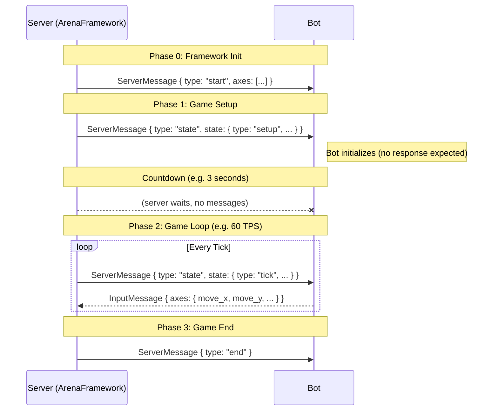

# Bot Protocol: Top-Down Shooter

This document describes the communication protocol between the Top-Down Shooter server and the bots.

---

## Running the Game

```bash
topdownshooter [flags]
```

### Flags

| Flag | Type | Default | Description |
| :--- | :--- | :--- | :--- |
| `--input-dir` | `string` | `./bots/inputs` | Path to the directory containing bot executables. |
| `--help` | | | Show all available flags and exit. |

### Examples

```bash
# Run with default settings (bots in ./bots/inputs)
topdownshooter

# Run with a custom bots directory
topdownshooter --input-dir ./my-bots

# Show help
topdownshooter --help
```

## Communication Flow



---

## Message Types

All messages from the server to the bot are wrapped in the ArenaFramework's `ServerMessage` envelope:

```json
{
  "type": "start" | "state" | "end",
  "state": { ... },
  "axes": [ ... ]
}
```

The `state` field contains game-specific data. Within it, the `type` field distinguishes between `"setup"` and `"tick"`.

---

### 1. Framework: `start`

Sent automatically by ArenaFramework when the game starts. The bot does **not** need to respond.

```json
{
  "type": "start",
  "axes": [
    { "name": "move_x", "value": 0 },
    { "name": "move_y", "value": 0 },
    { "name": "aim_x", "value": 0 },
    { "name": "aim_y", "value": 1 },
    { "name": "shoot", "value": 0 },
    { "name": "dash", "value": 0 }
  ]
}
```

---

### 2. Game: `state.setup`

Sent **once** before the game loop begins. The bot should use this to initialize its internal state and constants. **No response expected.**

After this message, the server waits `countdown_sec` seconds before starting the game loop.

```json
{
  "type": "state",
  "state": {
    "type": "setup",
    "tick_duration_ms": 16.66,
    "timeout_ms": 12,
    "max_tick": 3600,
    "countdown_sec": 3,
    "map": {
      "static": [
        { "type": "rect", "x": 0, "y": 0, "w": 2000, "h": 50 },
        { "type": "rect", "x": 0, "y": 0, "w": 50, "h": 2000 },
        { "type": "rect", "x": 1950, "y": 0, "w": 50, "h": 2000 },
        { "type": "rect", "x": 0, "y": 1950, "w": 2000, "h": 50 },
        { "type": "rect", "x": 900, "y": 900, "w": 200, "h": 200 },
        { "type": "circle", "x": 500, "y": 500, "r": 80 },
        { "type": "circle", "x": 1500, "y": 1500, "r": 80 },
        { "type": "poly", "points": [[300,1400],[400,1300],[500,1400]] },
        { "type": "poly", "points": [[1500,600],[1600,500],[1700,600]] }
      ]
    },
    "rules": {
      "move_speed": 3.5,
      "bullet_speed": 10.0,
      "damage": 34,
      "win_kills": 30,
      "respawn_ticks": 120,
      "shoot_cd": 25,
      "dash_cd": 180
    }
  }
}
```

#### Setup Fields

| Field | Type | Description |
| :--- | :--- | :--- |
| `tick_duration_ms` | `Float` | Duration of one tick in milliseconds. |
| `timeout_ms` | `Float` | Max time (ms) the bot has to respond per tick. |
| `max_tick` | `Int` | Total ticks in the round. |
| `countdown_sec` | `Int` | Seconds the server waits before the first tick. |
| `map.static` | `Array<MapObject>` | Static map geometry (does not change during the game). |
| `rules` | `Object` | Game constants (speeds, cooldowns, win conditions). |

---

### 3. Game: `state.tick`

Sent **every tick** (60 times per second) during the game loop. The bot **must respond with axes**.

```json
{
  "type": "state",
  "state": {
    "type": "tick",
    "tick": 1234,
    "players": [
      {
        "id": "bot_id_1",
        "x": 100.5,
        "y": 200.0,
        "aim_x": 0.707,
        "aim_y": 0.707,
        "hp": 100,
        "kills": 5,
        "deaths": 2,
        "shoot_cd": 10,
        "dash_cd": 120
      }
    ],
    "bullets": [
      { "x": 150.0, "y": 160.0, "dx": 1.0, "dy": 0.0 }
    ],
    "map": {
      "dynamic": [
        { "type": "rect", "x": 650, "y": 1000, "w": 120, "h": 40 }
      ]
    }
  }
}
```

#### Tick Fields

| Field | Type | Description |
| :--- | :--- | :--- |
| `tick` | `Int` | Current game tick number. |
| `players` | `Array<Player>` | All players in the game. |
| `bullets` | `Array<Bullet>` | All active bullets. |
| `map.dynamic` | `Array<MapObject>` | Dynamic map objects (positions change every tick). |

#### Player Object

| Field | Type | Description |
| :--- | :--- | :--- |
| `id` | `String` | Unique player identifier. |
| `x`, `y` | `Float` | Current position. |
| `aim_x`, `aim_y` | `Float` | Current normalized aiming direction. |
| `hp` | `Int` | Health points (0–100). 0 = dead. |
| `kills` | `Int` | Total kills this round. |
| `deaths` | `Int` | Total deaths this round. |
| `shoot_cd` | `Int` | Ticks until the bot can shoot again. |
| `dash_cd` | `Int` | Ticks until the bot can dash again. |

#### Bullet Object

| Field | Type | Description |
| :--- | :--- | :--- |
| `x`, `y` | `Float` | Current position. |
| `dx`, `dy` | `Float` | Normalized direction vector. |

#### Map Object (applies to both static and dynamic)

| Type | Fields | Description |
| :--- | :--- | :--- |
| `rect` | `x`, `y`, `w`, `h` | Rectangle at position (x, y) with width and height. |
| `circle` | `x`, `y`, `r` | Circle at center (x, y) with radius r. |
| `poly` | `points` | Polygon defined by an array of `[x, y]` coordinate pairs. |

---

### 4. Bot Response

The bot **must respond** to every `state.tick` message with an `InputMessage`:

```json
{
  "axes": {
    "move_x": 1.0,
    "move_y": 0.0,
    "aim_x": 0.5,
    "aim_y": -0.5,
    "shoot": 1,
    "dash": 0
  }
}
```

#### Axis Definitions

| Axis | Range | Description |
| :--- | :--- | :--- |
| `move_x` | `[-1.0, 1.0]` | Movement on the X axis. |
| `move_y` | `[-1.0, 1.0]` | Movement on the Y axis. |
| `aim_x` | `[-1.0, 1.0]` | Aiming direction X. |
| `aim_y` | `[-1.0, 1.0]` | Aiming direction Y. |
| `shoot` | `> 0` | Triggers a shot if `shoot_cd` is 0. |
| `dash` | `> 0` | Triggers a dash in the aiming direction if `dash_cd` is 0. |

> **Deadline**: Bots must respond within the configured `timeout_ms` (default: 12ms).

---

### 5. Framework: `end`

Sent when the game is over. The bot should exit gracefully. No response expected.

```json
{ "type": "end" }
```

---

## Game Rules & Constants

- **Movement Speed**: 3.5 units/tick.
- **Dash Speed**: 14.0 units/tick for 8 ticks.
- **Bullet Speed**: 10.0 units/tick.
- **Damage**: 34 per hit (3 hits to kill).
- **Respawn Time**: 120 ticks (2 seconds).
- **Shooting Cooldown**: 25 ticks.
- **Dashing Cooldown**: 180 ticks (3 seconds).
- **Win Condition**: Reach 30 kills or have the most kills when `max_tick` is reached.
- **Countdown**: 3 seconds before the first tick.
